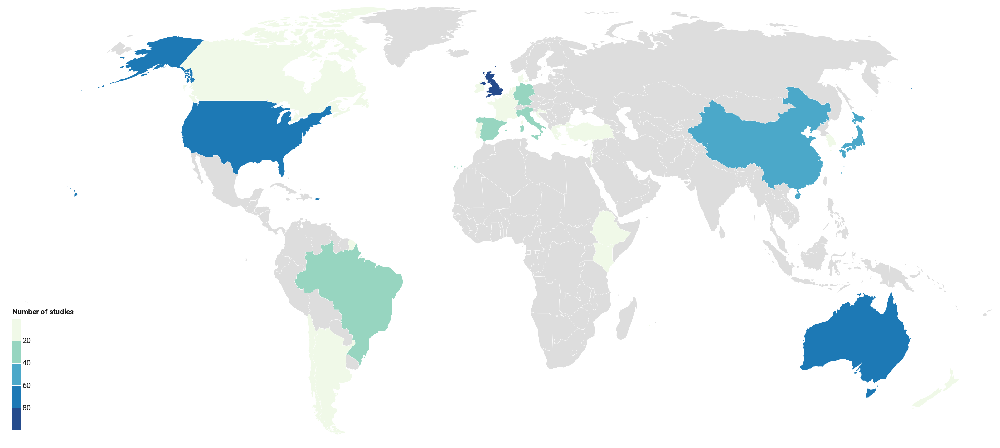

---
output:
  bookdown::pdf_document2: default
always_allow_html: true
toc: false
fontsize: 12pt
editor_options:
  chunk_output_type: inline
header-includes: \usepackage{float} \floatplacement{figure}{H} \floatplacement{table}{H}
---

```{r setup, include=FALSE}
knitr::opts_chunk$set(echo = FALSE, cache=FALSE) 
```
```{r include=FALSE}
library(magrittr)

data <- data<- read.csv('ghg_smap.csv', stringsAsFactors = FALSE)
data$rownum <- seq(1, nrow(data)) #add row numbers

buildGSlink <- function(title) {
  GSlink <- sub(" ", "", paste0("https://scholar.google.co.uk/scholar?start=0&q=", gsub(" ", "+", (gsub("[[:punct:]]", "", title))), "&hl=en&as_sdt=0,5"))
}
data$url <- buildGSlink(data$title)
write.csv(data, 'mapdatabase.csv', row.names = FALSE)

#' Create unique article-level data for plots about articles
articledat <- data %>%
  dplyr::distinct(citation_full, .keep_all = TRUE)

#Objects for text references
num_art <- nrow(articledat)
num_stud <- nrow(data)
pub_typePC <- data.frame('Type' = rownames(as.data.frame((summary(as.factor(articledat$pub_type))))), 'Articles' = (as.data.frame((summary(as.factor(articledat$pub_type)))))[,1])
type_art <- expss::vlookup('Article', pub_typePC, 'Articles')
type_thes <- expss::vlookup('Thesis', pub_typePC, 'Articles')
type_conf <- expss::vlookup('Conference Proceeding', pub_typePC, 'Articles')
type_rep <- expss::vlookup('Report', pub_typePC, 'Articles')

#' Summarise by country
data$country <- gsub('Isreal', 'Israel', data$country)
data$country <- gsub('UK', 'United Kingdom', data$country)
data$country <- gsub('Scotland', 'United Kingdom', data$country)
country_summary <- data %>% 
  dplyr::count(country, sort = TRUE)
country_summary <- country_summary[order(-country_summary$n),]
country_summary2 <- country_summary
country_summary2$url <- paste0('database.html?q=country_', country_summary2$country)
write.csv(country_summary2, 'country_summary.csv', row.names=FALSE)
above10pccountries <- subset(country_summary, n > (sum(n)/10))
above10pccountries <- paste0(above10pccountries[,1], ' (', above10pccountries[,2], ')')

#' Summarise by climate zone
data$KPG_zone <- gsub('NR', 'Not reported', data$KPG_zone)
clim_summary <- data %>% 
  dplyr::count(KPG_zone, sort = TRUE)
clim_summary <- clim_summary[order(-clim_summary$n),] %>%
  dplyr::rename('Köppen-Geiger climate zone' = KPG_zone)
climtop <- clim_summary[1,]
climtwo <- clim_summary[2,]
climno <- subset(clim_summary, clim_summary[,1] == 'Not reported')[2]

#' Summarise by soil texture classification
data$soil_text_class <- trimws(data$soil_text_class)
data$soil_text_class <- gsub('Clayloam', 'Clay loam', data$soil_text_class)
data$soil_text_class <- gsub('NR', 'Not reported', data$soil_text_class)
data$USDA_soil_class <- gsub('NR', 'Not reported', data$USDA_soil_class)
data$FAO_soil_class <- gsub('NR', 'Not reported', data$FAO_soil_class)
data$soil_text_class[!nzchar(data$soil_text_class)] <- "Not reported"
data$soilorder <- factor(data$soil_text_class, levels=c("Clay", "Clay loam", "Loam", "Loamy sand", "Sand", "Sandy clay",  "Sandy clay loam", "Sandy loam", "Silt", "Silt loam", "Silty clay", "Silty clay loam", "Unclear", "Not reported"))
soil_summary <- data %>% 
  dplyr::count(soil_text_class, sort = TRUE)
soilnr <- expss::vlookup('Not reported', soil_summary, 'n')
soilnrdat <- subset(data, soil_text_class == 'Not reported')
soilnr_summary <- soilnrdat %>% 
  dplyr::count(USDA_soil_class, FAO_soil_class, sort = TRUE) %>%
  dplyr::rename('USDA soil classification' = USDA_soil_class, 'FAO soil classification' = FAO_soil_class)

#' Field history
data$field_hist_descr <- trimws(data$field_hist_descr)
fhist_summary <- data %>% 
  dplyr::count(field_hist_descr, sort = TRUE)
fhist_yes <- expss::vlookup('Yes', fhist_summary, 'n')

#' Study length
stlength_summary <- data %>% 
  dplyr::count(total_months, sort = TRUE)
stlength_nr <- expss::vlookup('NR', stlength_summary, 'n')
stlength_unclear <- expss::vlookup('Unclear', stlength_summary, 'n')
stlength_no <- expss::vlookup('', stlength_summary, 'n')

below12months <- subset(data, as.numeric(total_months) < 12)
below12months_summary <- below12months %>% 
  dplyr::count(total_months, sort = TRUE)

#' Study design
data$study_design <- gsub('NR', 'Not reported', data$study_design)
data$study_design <- gsub('CI', 'Control-impacts', data$study_design)
data$study_design <- gsub('BA', 'Before-after', data$study_design)
stdes_summary <- data %>% 
  dplyr::count(study_design, sort = TRUE)

#' Experimental design
data$experimental_design <- gsub('NR', 'Not reported', data$experimental_design)
data$experimental_design <- gsub('Randomized', 'Randomised', data$experimental_design)
data$experimental_design <- gsub('Randomised Complete Block', 'Randomised complete block', data$experimental_design)
data$experimental_design[!nzchar(data$experimental_design)] <- "Not reported"
data$experimental_design <- factor(data$experimental_design, levels=c("Purposive", "Paired design", "Split/strip plot", "Latin square", "Randomised", "Randomised complete block", "Unclear", "Not reported"))
expdes_summary <- data %>% 
  dplyr::count(experimental_design, sort = TRUE)
expdes_nr <- expss::vlookup('Not reported', expdes_summary, 'n')
expdes_uncl <- expss::vlookup('Unclear', expdes_summary, 'n')

#' Spatial replication
data$spatial_replic <- gsub('2 per treatment for treatments of A controlled-release fertilizer made from calcium nitrate coated in polyolefin resin, and Calcium nitrate. No replication for treatments of A controlled-release fertilizer made from Urea coated with polyolefin resin, and No nitrogen.', '2', data$spatial_replic)
data$sp_rep <- as.numeric(tidyr::extract_numeric(data$spatial_replic))
sp_rep_dat <- data %>% 
  dplyr::count(sp_rep, sort = TRUE)

#' Temporal replication
temp_rep_dat <- data %>% 
  dplyr::count(temporal_replic, sort = TRUE) %>%
  dplyr::rename('Temporal replication' = temporal_replic)
temprep_no <- expss::vlookup('No', temp_rep_dat, 'n')
temprep_yes <- expss::vlookup('Yes', temp_rep_dat, 'n')
temprep_nr <- expss::vlookup('Not reported', temp_rep_dat, 'n')
if (is.na(temprep_nr) == TRUE){
  temprep_nr <- 'no'
}

#' Interventions
intervention_dat <- data %>% 
  dplyr::count(interv_type, sort = TRUE)
intervention_dat$interv_type <- gsub('Multiple-intervention', 'Multiple interventions', intervention_dat$interv_type)
interv_mult <- expss::vlookup('Multiple interventions', intervention_dat, 'n')
intervdata <- data %>%
  tidyr::separate_rows(.,
                       multiple_interv_codes,
                       sep = ', ')
intervdata$all_interv <- trimws(intervdata$multiple_interv_codes)
intervdata$all_interv <- stringr::str_to_sentence(tolower(intervdata$all_interv))
allintervention_dat <- intervdata %>% 
  dplyr::count(all_interv, sort = TRUE)

#' Outcomes
data$outcome <- gsub('CH4, N2O, CO2', 'CH4, CO2, N2O', data$outcome)
data$outcome <- gsub('N2O, CO2', 'CO2, N2O', data$outcome)
data$outcome <- gsub('N2O, CO2, CH4', 'CH4, CO2, N2O', data$outcome)
data$outcome <- gsub('CO2, N2O, CH4', 'CH4, CO2, N2O', data$outcome)
outcomes_sumdat <- data %>% 
  dplyr::count(outcome, sort = TRUE) %>%
  dplyr::rename('Outcome' = outcome)
multoutcometab <- subset(outcomes_sumdat, nchar(Outcome) > 3)
multoutcometab$Outcome <- gsub('N2O', 'N~2~O', multoutcometab$Outcome)
multoutcometab$Outcome <- gsub('CO2', 'CO~2~', multoutcometab$Outcome)
multoutcometab$Outcome <- gsub('CH4', 'CH~4~', multoutcometab$Outcome)
alloutcomes <- expss::vlookup('CH~4~, CO~2~, N~2~O', multoutcometab, 'n')
data$outcome <- gsub('NO2', 'N2O', data$outcome)
data$outcome[!nzchar(data$outcome)] <- "Not reported"
outcomesdata <- data %>%
  tidyr::separate_rows(.,
                       outcome,
                       sep = ', ')
outcomesdata$outcome <- gsub('N2O', 'N~2~O', outcomesdata$outcome)
outcomesdata$outcome <- gsub('CO2', 'CO~2~', outcomesdata$outcome)
outcomesdata$outcome <- gsub('CH4', 'CH~4~', outcomesdata$outcome)
outcomes_summary <- outcomesdata %>% 
  dplyr::count(outcome, sort = TRUE) %>%
  dplyr::rename('Outcome' = outcome)

#' Interventions by outcome
intervoutcome <- intervdata %>%
  tidyr::separate_rows(.,
                       outcome,
                       sep = ', ')
intervoutcome_sum <- intervoutcome %>% 
  dplyr::count(all_interv, outcome, sort = TRUE) %>%
  dplyr::rename('Intervention' = all_interv, 'Outcome' = outcome)

#' Outcome measurement
data$sampling_equip[!nzchar(data$sampling_equip)] <- "Not reported"
data$sampling_equip <- gsub('NR', 'Not reported', data$sampling_equip)
ocmeas_summary <- data %>% 
  dplyr::count(sampling_equip, sort = TRUE)
data$sampling_equip <- factor(data$sampling_equip, levels=c(ocmeas_summary[,1]))
ocmeas_nr <- expss::vlookup('Not reported', ocmeas_summary, 'n')
topocmeas <- if (ocmeas_summary[1,1] == 'Not reported'){ocmeas_summary[2,]} else {ocmeas_summary[1,]}
opcl_sum <- data %>% 
  dplyr::count(open_closed, sort = TRUE)
open <- expss::vlookup('Open', opcl_sum, 'n')
closed <- expss::vlookup('Closed', opcl_sum, 'n')
transpop_sum <- data %>% 
  dplyr::count(transp_opaque, sort = TRUE)
transparent <- expss::vlookup('Transparent', transpop_sum, 'n')
opaque <- expss::vlookup('Opaque', transpop_sum, 'n')

#' Heat maps
alloutintdata <- intervdata %>%
  tidyr::separate_rows(.,
                       outcome,
                       sep = ', ') #within separated intervention data, also separate outcomes
summdat <- alloutintdata %>% 
  dplyr::count(all_interv, 
               country, 
               outcome) #summarise all interventions and outcomes
summdat$country <- factor(summdat$country, levels=c("Kenya", "Ethiopia", "South Korea", "Japan", "China", "United Kingdom", "Turkey", "Spain", "Portugal", "Netherlands",
                                                    "Italy", "Ireland", "Greece", "Germany", "France", "Denmark", "Croatia", "Belgium", "Israel", "USA", "Canada", "New Zealand",
                                                    "Australia", "Chile", "Brazil", "Argentina"))
intervdata$multiple_interv_codes <- trimws(stringr::str_to_sentence(tolower(intervdata$multiple_interv_codes)))
climzone_int <- intervdata %>% 
  dplyr::count(KPG_zone, multiple_interv_codes, sort = TRUE)
soil_int <- intervdata %>% 
  dplyr::count(soilorder, multiple_interv_codes, sort = TRUE)
```

# Results {-}
## The systematic mapping process {-}
Details of the number of records retained through each stage of the review process are provided in Figure \ref{fig:flowchart}. A total of 38,825 potentially relevant records were identified across all resources searched. A total of 25,683 unique records was screened for eligibility, with 347 eligible records following full text screening. The final systematic map database contains `r num_stud` studies from `r num_art` articles.

```{r flowchart, fig.cap="ROSES flow chart for the systematic map, showing the number of records retained at each stage of the review process. Produced using the R package 'ROSES_flowchart' (Haddaway 2020).", echo=FALSE}
source('ROSES_flowchart.R')
flowchart <- ROSES_flowchart(dbresults = '38,325',
                otherresults = '500',
                deduped = '25,683',
                dupesremoved = '13,187',
                tandaincl = '1,813',
                tandaexcl = '23,825',
                titleincl = '',
                titleexcl = '',
                abstractincl = '',
                abstractexcl = '',
                ftretr = '1,772',
                ftnotretr <- data.frame(reason = c('Not accessible', 'Not found'), n = c(' 41', ' 0')),
                ftincl = '347',
                ftexcl <- data.frame(reason = c('Relevant review', 'Population', 'Intervention', 'Comparator', 'Outcome', 'Study design', 'Duplicate', 'Language'), n = c('47', '826', '49', '70', '69', '188', '36', '127')),
                prescreened = '4',
                studart <- c('350', '534'),
                finalmapincl = '538',
                type = 'map')
rsvg::rsvg_pdf(svg = charToRaw(DiagrammeRsvg::export_svg(flowchart)),
                   file = 'figures/figure1.pdf')
flowchart
```

## The systematic map database and visualisations {-}
### Descriptive information {-}

**Publication year:** As expected, there has been a significant increase in the number of published articles on the topic over the last 20 years (Figure \ref{fig:yearplot}). Interestingly, there may be evidence of a reduction in publication rate over the most recent 5 years from 2014 to 2018. The earliest record in our database is from 1981. Since searches were performed in 2019, representation from this year is incomplete.

```{r yearplot, echo=FALSE, warning=FALSE, message=FALSE, fig.cap="Plot showing the final number of articles included in the systematic map by publication year.", results = "hide", fig.keep = 'all'}
yearplot <- ggplot2::ggplot(data = articledat, 
                           ggplot2::aes(x = as.numeric(year))) +
  ggplot2::geom_bar(stat = "bin", 
                    binwidth = 1, 
                    color = 'White', 
                    fill = '#8CB3B0') + 
  ggplot2::theme_minimal() + 
  ggplot2::labs(
    x = "Publication year", 
    y = "Number of studies")
pdf(file = 'figures/figure 2.pdf', width = (dev.size())[1], height = (dev.size())[2])
  yearplot
dev.off()
yearplot
```


**Publication type:** Some `r round((type_art/num_art)*100, digits = 0)`% of articles in the map database are traditional research papers, with only `r type_thes` theses, `r type_conf` conference papers, and `r type_rep` report. This may in some degree reflect the ease with which traditional research articles can be discovered, but may also be the result of the complex and expensive GHG measurement equipment needed for this type of research: it may be unlikely that unpublished reports would be conducted on a local or organisation scale.
\newline 
\newline 
**Country:** The choropleth in Figure \ref{fig:choroplot} displays the number of studies per country in the map. Some `r length(above10pccountries)` countries each represented more than 10% of the total studies in the evidence base: `r paste0(paste(above10pccountries[1:length(above10pccountries)-1], collapse = ', '), ', and ', above10pccountries[length(above10pccountries)])`. Much of the evidence came from Europe (a total of 227 studies).


```{r choroplot, echo=FALSE, out.width='100%', warning=FALSE, message=FALSE, fig.cap="Choropleth showing the number of studies per country in the systematic map database."}

```

**Climate zone:** Table \ref{tab:climtab} displays the distribution of studies across climate zones. The most frequently studied climate zone was `r climtop[1]` with `r climtop[2]` studies. `r climtwo[1]` was the second most studied zone with `r climtwo[2]` studies. Some `r climno` studies could not be located to a climate zone.

``` {r climtab, warning=FALSE, messages=FALSE, echo=FALSE}
knitr::kable(clim_summary, caption = "Number of studies conducted in each eligible Köppen-Geiger climate zone. 'n' indicates the number of studies.")
```

**Soil texture:** The most frequently reported soil texture information was from the [USDA Natural resources conservation service soil texture classification system](https://www.nrcs.usda.gov/wps/portal/nrcs/main/soils/survey/class/). Figure \ref{fig:soiltextplot} shows the distribution of soil texture classifications across the evidence base. A large number of studies (`r soilnr` of `r num_stud`) did not report the soil texture classification. Table \ref{tab:soilothertab} displays the soil texture data reported for studies not reporting soil texture classification, showing that `r soilnr_summary[1,3]` studies provided no data from any of the three soil classification systems, hampering synthesis of these data.

``` {r soiltextplot, warning=FALSE, message=FALSE, echo=FALSE, fig.cap="Soil texture classifications of studies in the systematic map.", results = "hide", fig.keep = 'all'}
soiltextplot <- ggplot2::ggplot(data = data, 
                           ggplot2::aes(x = soilorder)) +
  ggplot2::geom_bar(stat = "count",
                    color = 'White', 
                    fill = '#8CB3B0') + 
  ggplot2::theme_minimal() +
  ggplot2::scale_x_discrete(limits = rev(levels(data$soilorder))) +
  ggplot2::stat_count(geom = "text", colour = "#8CB3B0", size = 3.5,
                      ggplot2::aes(label = ..count..), 
                      position = ggplot2::position_nudge(y = 3)) +
  ggplot2::coord_flip() + 
  ggplot2::labs(
    x = "Soil texture classification", 
    y = "Number of studies")
pdf(file = 'figures/figure 4.pdf', width = (dev.size())[1], height = (dev.size())[2])
  soiltextplot
dev.off()
soiltextplot
```

``` {r soilothertab, echo=FALSE}
soilnr_summary[] <- lapply(soilnr_summary, function(x){gsub('Not reported', '', x)})
knitr::kable(soilnr_summary, caption = "Soil classifications of studies not using the USDA Natural Resources Conservation Service soil texture classification system. Blank cells indicate no data. 'n' indicates the number of studies.")
```

**Field history description:** Just over half of the studies in the systematic map (`r fhist_yes` of `r num_stud`) provided a description of the previous management practices used within the experimental fields. 
\newline 
\newline 
**Study length:** The duration of investigation was reported in `r length(na.omit(as.numeric(data$total_months)))` of `r num_stud` studies. Figure \ref{fig:studylength} shows the range of study durations used across the included studies. Median study length was `r median(na.omit(as.numeric(data$total_months)))` months.

``` {r studylength, echo=FALSE, warning=FALSE, message=FALSE, fig.cap="Study durations employed across the evidence base, collated into 6 month bins.", results = "hide", fig.keep = 'all'}
studylength <- ggplot2::ggplot(data = data, 
                           ggplot2::aes(x = (as.numeric(total_months))/12)) +
  ggplot2::geom_bar(stat = "bin", 
                    binwidth = .25,
                    color = 'White', 
                    fill = '#8CB3B0') + 
  ggplot2::theme_minimal() +
  ggplot2::labs(
    x = "Study length in years", 
    y = "Number of studies")
pdf(file = 'figures/figure 5.pdf', width = (dev.size())[1], height = (dev.size())[2])
  studylength
dev.off()
studylength
```

For studies lasting less than 1 year (n = `r nrow(below12months)`), the median study length was `r median(as.numeric(below12months$total_months))` months (see Figure \ref{fig:studylength2}).

``` {r studylength2, echo=FALSE, warning=FALSE, message=FALSE, fig.cap="Study durations for investigations less than 1 year in length.", results = "hide", fig.keep = 'all'}
studylength2 <- ggplot2::ggplot(data = below12months, 
                           ggplot2::aes(x = as.numeric(total_months))) +
  ggplot2::geom_bar(stat = "count",
                    color = 'White', 
                    fill = '#8CB3B0') + 
  ggplot2::stat_count(geom = "text", colour = "#8CB3B0", size = 3.5,
                      ggplot2::aes(label = ..count..), 
                      position = ggplot2::position_nudge(y = 1)) +
  ggplot2::theme_minimal() +
  ggplot2::labs(
    x = "Study length in months", 
    y = "Number of studies")
pdf(file = 'figures/figure 6.pdf', width = (dev.size())[1], height = (dev.size())[2])
  studylength2
dev.off()
studylength2
```

**Study design:** The most frequently employed study design across the evidence base was `r tolower(stdes_summary[1,1])` (n = `r stdes_summary[1,2]` studies). `r stdes_summary[2,1]` was much less common (n = `r stdes_summary[2,2]`). Study design was not reported in `r if(stdes_summary[3,2]>1){paste(stdes_summary[3,2], 'studies')} else {paste(stdes_summary[3,2], 'study')}`.
\newline 
\newline 
**Experimental design:** The most commonly used experimental design in the included studies was '`r tolower(expdes_summary[1,1])`', with `r expdes_summary[1,2]` studies, with '`r tolower(expdes_summary[2,1])`' the next most frequent (n = `r tolower(expdes_summary[2,2])`). Figure \ref{fig:expdesplot} displays the frequency of all experimental designs. The experimental design was not reported or unclear in `r expdes_nr` and `r expdes_uncl` studies, respectively.

``` {r expdesplot, echo=FALSE, warning=FALSE, message=FALSE, fig.cap="Experimental designs employed across studies in the systematic map.", results = "hide", fig.keep = 'all'}
data$experimental_design <- factor(data$experimental_design, levels=c("Not reported", "Unclear", "Purposive", "Paired design", "Split/strip plot", "Latin square", "Randomised", "Randomised complete block"))
expdesplot <- ggplot2::ggplot(data = data, 
                           ggplot2::aes(x = experimental_design)) +
  ggplot2::geom_bar(stat = "count",
                    color = 'White', 
                    fill = '#8CB3B0') + 
  ggplot2::theme_minimal() +
  ggplot2::coord_flip() + 
  ggplot2::stat_count(geom = "text", colour = "#8CB3B0", size = 3.5,
                      ggplot2::aes(label = ..count..), 
                      position = ggplot2::position_nudge(y = 10)) +
  ggplot2::labs(
    x = "Experimental design", 
    y = "Number of studies")
pdf(file = 'figures/figure 7.pdf', width = (dev.size())[1], height = (dev.size())[2])
  expdesplot
dev.off()
expdesplot
```

**Spatial replication:** Figure \ref{fig:spatrepplot} shows the range of spatial replication across all studies. This demonstrates an overall very low level of true replication (no study used greater than `r max(na.omit(data$sp_rep))` spatial replicates): this is likely hindered by challenges in replicating field- or farm- scale experiments. The median level of true spatial replication was `r median(na.omit(data$sp_rep))` replicates. 

``` {r spatrepplot, echo=FALSE, warning=FALSE, message=FALSE, fig.cap="Study spatial replication (replicates per treatment group) across included studies in the map.", results = "hide", fig.keep = 'all'}
spatrepplot <- ggplot2::ggplot(data = data, 
                           ggplot2::aes(x = sp_rep)) +
  ggplot2::geom_bar(stat = "count",
                    color = 'White', 
                    fill = '#8CB3B0') + 
  ggplot2::stat_count(geom = "text", colour = "#8CB3B0", size = 3.5,
                      ggplot2::aes(label = ..count..), 
                      position = ggplot2::position_nudge(y = 5)) +
  ggplot2::theme_minimal() +
  ggplot2::labs(
    x = "Spatial replication (replicates per group)", 
    y = "Number of studies")
pdf(file = 'figures/figure 8.pdf', width = (dev.size())[1], height = (dev.size())[2])
  spatrepplot
dev.off()
spatrepplot
```

**Temporal replication:** Most studies in the map did not take measurements at more than one time point (n = `r temprep_no`): `r temprep_yes` studies did employ temporal replication, and `r temprep_nr` studies did not report this information.
\newline 
\newline 
**Interventions:** Figure \ref{fig:intervplot} shows the types of interventions investigated in the evidence base. Here, we define intervention types as the broad category of management practice used, as opposed to treatments (see below), which are the individual management practices investigated within each study. A total of `r interv_mult` out of `r num_stud` studies examined multiple interventions together. The top three most frequently studied single intervention types were `r tolower(intervention_dat[2,1])` (n = `r intervention_dat[2,2]`), `r tolower(intervention_dat[3,1])` (n = `r intervention_dat[3,2]`), and `r tolower(intervention_dat[4,1])` (n = `r intervention_dat[4,2]`). Across all intervention types, the top three most frequently studied were: 1) `r tolower(allintervention_dat[1,1])` (n = `r allintervention_dat[1,2]`); 2) `r tolower(allintervention_dat[2,1])` (n = `r allintervention_dat[2,2]`); 3) `r tolower(allintervention_dat[3,1])` (n = `r allintervention_dat[3,2]`); 4) `r tolower(allintervention_dat[4,1])` (n = `r allintervention_dat[4,2]`); and, 5) `r tolower(allintervention_dat[5,1])` (n = `r allintervention_dat[5,2]`). 

``` {r intervplot, echo=FALSE, warning=FALSE, message=FALSE, fig.cap="Interventions investigated in the studies within the systematic map: a) the number of studies investigating each type of intervention, and b) the number of studies investigating each intervention type (including multiple intervention studies).", fig.show="hold", out.width="50%", results = "hide", fig.keep = 'all'}
par(mfrow=c(2,1))
intervplota <- ggplot2::ggplot(data = data, 
                           ggplot2::aes(x = interv_type)) +
  ggplot2::geom_bar(stat = "count",
                    color = 'White', 
                    fill = '#8CB3B0') + 
  ggplot2::theme_minimal() +
  ggplot2::scale_x_discrete(limits = rev(levels(data$interv_type))) +
  ggplot2::coord_flip() + 
  ggplot2::stat_count(geom = "text", colour = "#8CB3B0", size = 3.5,
                      ggplot2::aes(label = ..count..), 
                      position = ggplot2::position_nudge(y = 10)) +
  ggplot2::labs(
    title = "a) Study-level",
    x = "Type of intervention(s) studied", 
    y = "Number of studies")
intervplotb <- ggplot2::ggplot(data = intervdata, 
                           ggplot2::aes(x = all_interv)) +
  ggplot2::geom_bar(stat = "count",
                    color = 'White', 
                    fill = '#8CB3B0') + 
  ggplot2::theme_minimal() +
  ggplot2::scale_x_discrete(limits = levels(intervdata$all_interv)) +
  ggplot2::coord_flip() + 
  ggplot2::stat_count(geom = "text", colour = "#8CB3B0", size = 3.5,
                      ggplot2::aes(label = ..count..), 
                      position = ggplot2::position_nudge(y = 10)) +
  ggplot2::labs(
    title = "b) Intervention-level",
    x = "Type of intervention(s) studied", 
    y = "Number of studies")
pdf(file = 'figures/figure 9a.pdf', width = (dev.size())[1], height = (dev.size())[2])
  intervplota
dev.off()
pdf(file = 'figures/figure 9b.pdf', width = (dev.size())[1], height = (dev.size())[2])
  intervplotb
dev.off()
intervplota
intervplotb
```

**Treatments:** Within intervention types, studies often investigated multiple treatment levels/types (see Figure \ref{fig:treatplot}). The median number of treatments was `r median(na.omit(as.numeric(data$treatments)))`.

``` {r treatplot, echo=FALSE, warning=FALSE, message=FALSE, fig.cap="Number of treatments investigated in studies included in the systematic map.", results = "hide", fig.keep = 'all'}
data$treatments <- as.numeric(data$treatments)
treatplot <- ggplot2::ggplot(data = data, 
                           ggplot2::aes(x = treatments)) +
  ggplot2::geom_bar(color = 'White', 
                    fill = '#8CB3B0') + 
  ggplot2::theme_minimal() +
  ggplot2::scale_x_continuous(breaks = c(0, 25, 50, 75, 100, 125)) +
  ggplot2::labs(
    x = "Number of treatments per study", 
    y = "Number of studies")
pdf(file = 'figures/figure 10.pdf', width = (dev.size())[1], height = (dev.size())[2])
  treatplot
dev.off()
treatplot
```

**Outcomes:** Tables \ref{tab:outcometab1} and \ref{tab:outcometab2} show the measured outcomes across all studies in the map, across outcomes and where outcomes were measured together, respectively. All three outcomes were reported in `r alloutcomes` studies. The next most commonly co-measured outcomes were `r paste(unlist(stringr::str_split(multoutcometab[2,1], ', ')), collapse = ' and ')` (n = `r multoutcometab[2,2]`) and `r paste(unlist(stringr::str_split(multoutcometab[3,1], ', ')), collapse = ' and ')` (n = `r multoutcometab[3,2]`).

``` {r outcometab1, echo=FALSE}
outcomes_summary$Outcome <- gsub('N~2~O', 'Nitrous oxide', outcomes_summary$Outcome)
outcomes_summary$Outcome <- gsub('CO~2~', 'Carbon dioxide', outcomes_summary$Outcome)
outcomes_summary$Outcome <- gsub('CH~4~', 'Methane', outcomes_summary$Outcome)
outcomes_summary$Outcome <- gsub('NR', 'Not reported', outcomes_summary$Outcome)
knitr::kable(outcomes_summary, caption = "Outcomes measured across studies in the systematic map. 'n' indicates the number of studies.") 
```
``` {r outcometab2, echo=FALSE}
multoutcometab$Outcome <- gsub('N~2~O', 'Nitrous oxide', multoutcometab$Outcome)
multoutcometab$Outcome <- gsub('CO~2~', 'Carbon dioxide', multoutcometab$Outcome)
multoutcometab$Outcome <- gsub('CH~4~', 'Methane', multoutcometab$Outcome)
df <- data.frame('Outcomes' = multoutcometab[,1], 'n' = multoutcometab[,2])
knitr::kable(df, caption = "Outcomes measured together in studies measuring multiple outcomes in the systematic map. 'n' indicates the number of studies.")
```

Figure \ref{fig:outcomeyr} shows the distribution of measured outcomes across time (the final study measurement year), showing the consistent interest in nitrous oxide. These patterns give no indication of a change in attention to specific GHGs over time.

``` {r outcomeyr, echo=FALSE, warning=FALSE, message=FALSE, fig.cap="Measured outcomes across all studies by the final study measurement year.", results = "hide", fig.keep = 'all'}
outcomesdata$outcome <- gsub('N~2~O', 'Nitrous oxide', outcomesdata$outcome)
outcomesdata$outcome <- gsub('CO~2~', 'Carbon dioxide', outcomesdata$outcome)
outcomesdata$outcome <- gsub('CH~4~', 'Methane', outcomesdata$outcome)
outcomesdata$outcome <- gsub('NR', 'Not reported', outcomesdata$outcome)
outcomeyear <- data.frame(last_meas_year = as.numeric(outcomesdata$last_meas_year), outcome = outcomesdata$outcome)
outcomeyear <- na.omit(outcomeyear)
outcomeyear <- ggplot2::ggplot(data = outcomeyear, 
                           ggplot2::aes(x = last_meas_year, fill = outcome)) +
  ggplot2::geom_bar(stat="count", color = 'White') + 
  ggplot2::scale_fill_manual(values = c("#EAC4D5", "#8CB3B0", "#5B5F97", "#DBB957")) +
  ggplot2::scale_x_continuous(breaks = seq(floor(min(outcomeyear$last_meas_year)/10)*10, ceiling(max(outcomeyear$last_meas_year)/10)*10, 5)) +
  ggplot2::theme_minimal() +
  ggplot2::labs(
    x = "Final measurement year", 
    y = "Number of studies")
pdf(file = 'figures/figure 11.pdf', width = (dev.size())[1], height = (dev.size())[2])
  outcomeyear
dev.off()
outcomeyear
```


In Figure \ref{fig:outcomeinterv}, the total number of measured outcomes across all investigated interventions shows the prominance of nitrous oxide in research on fertilisers and nitrification inhibition. 

``` {r outcomeinterv, echo=FALSE, warning=FALSE, message=FALSE, fig.cap="Measured outcomes across all interventions investigated.", results = "hide", fig.keep = 'all'}
#need all outcomes across all interventions`
intervoutcome$outcome <- gsub('N2O', 'Nitrous oxide', intervoutcome$outcome)
intervoutcome$outcome <- gsub('CO2', 'Carbon dioxide', intervoutcome$outcome)
intervoutcome$outcome <- gsub('CH4', 'Methane', intervoutcome$outcome)
intervoutcome$outcome <- gsub('NR', 'Not reported', intervoutcome$outcome)
outcomeint <- ggplot2::ggplot(data = intervoutcome, 
                           ggplot2::aes(x = all_interv, fill = outcome)) +
  ggplot2::geom_bar(stat="count", color = 'White') + 
  ggplot2::scale_fill_manual(values = c("#EAC4D5", "#8CB3B0", "#5B5F97", "#DBB957")) +
  #ggplot2::scale_x_continuous(breaks = seq(floor(min(outcomeyear$last_meas_year)/10)*10, ceiling(max(outcomeyear$last_meas_year)/10)*10, 5)) +
  ggplot2::theme_minimal() +
  ggplot2::coord_flip() + 
  ggplot2::labs(
    fill = "Outcome",
    x = "Intervention", 
    y = "Number of intervention-outcome pairs")
pdf(file = 'figures/figure 12.pdf', width = (dev.size())[1], height = (dev.size())[2])
  outcomeint
dev.off()
outcomeint
```

Figure \ref{fig:outcomeclimate} shows the number of measured outcomes across all study climates. There is a somewhat smaller proportion of studies of nitrous oxide relative to other GHGs in Csa zones than Cfa and Cfb, but the total studies in this climate zone is also much smaller.

``` {r outcomeclimate, echo=FALSE, warning=FALSE, message=FALSE, fig.cap="Measured outcomes across all studies by the climate zone.", results = "hide", fig.keep = 'all'}
outcomesdata$outcome <- gsub('N~2~O', 'Nitrous oxide', outcomesdata$outcome)
outcomesdata$outcome <- gsub('CO~2~', 'Carbon dioxide', outcomesdata$outcome)
outcomesdata$outcome <- gsub('CH~4~', 'Methane', outcomesdata$outcome)
outcomesdata$outcome <- gsub('NR', 'Not reported', outcomesdata$outcome)
outcomezone <- ggplot2::ggplot(data = outcomesdata, 
                           ggplot2::aes(x = KPG_zone, fill = outcome)) +
  ggplot2::geom_bar(stat="count", color = 'White') + 
  ggplot2::scale_fill_manual(values = c("#EAC4D5", "#8CB3B0", "#5B5F97", "#DBB957")) +
  ggplot2::theme_minimal() +
  ggplot2::labs(
    fill = 'Outcome',
    x = "Köppen-Geiger climate zone", 
    y = "Number of studies")
pdf(file = 'figures/figure 13.pdf', width = (dev.size())[1], height = (dev.size())[2])
  outcomezone
dev.off()
outcomezone
```

**Outcome measurement methods:** The most commonly reported measurement method was '`r tolower(topocmeas[,1])`' (n = `r topocmeas[,2]`) (see Figure \ref{fig:ocmeasplot}). A substantial proportion of studies (n = `r ocmeas_nr`) did not report the outcome sampling methods used. 

``` {r ocmeasplot, echo=FALSE, warning=FALSE, messages=FALSE, fig.cap="Experimental designs employed across studies in the systematic map.", results = "hide", fig.keep = 'all'}
data$sampling_equip <- gsub('Dynamic chambers', 'Dynamic chamber', data$sampling_equip)
data$sampling_equip <- gsub('NR', 'Not reported', data$sampling_equip)
data$sampling_equip <- factor(data$sampling_equip, levels=c("Static chamber", "Dynamic chamber", "Both static and dynamic", "Eddy flux covariance tower", "Not reported"))
ocmeasplot <- ggplot2::ggplot(data = data, 
                           ggplot2::aes(x = sampling_equip)) +
  ggplot2::geom_bar(color = 'White', 
                    fill = '#8CB3B0') + 
  ggplot2::theme_minimal() +
  ggplot2::coord_flip() + 
  ggplot2::scale_x_discrete(limits = rev(levels(data$sampling_equip))) +
  ggplot2::stat_count(geom = "text", colour = "#8CB3B0", size = 3.5,
                      ggplot2::aes(label = ..count..), 
                      position = ggplot2::position_nudge(y = 10)) +
  ggplot2::labs(
    x = "Outcome sampling equipment", 
    y = "Number of studies")
pdf(file = 'figures/figure 14.pdf', width = (dev.size())[1], height = (dev.size())[2])
  ocmeasplot
dev.off()
ocmeasplot
```

Open chambers were used in `r open` studies, whilst closed were used in `r closed` (it was not possible to ascertain this information for the remaining studies). Opaque chambers were used in `r opaque` studies, whilst transparent were used in `r transparent` (it was not possible to ascertain this information for the remaining studies). 


### Heat maps {-}

In Figure \ref{fig:bubbleplot}, interventions have been plotted against countries for the three measured outcomes. 

``` {r bubbleplot, echo=FALSE, fig.cap="Bubble plot of intervention type against study country and measured outcome for studies in the systematic map. 'n' indicates the number of studies. Countries coloured by continent.", fig.dim = c(12, 10), warning=FALSE, messages=FALSE, results = "hide", fig.keep = 'all'}
source('bubbleplot.R')
summdat$outcome <- gsub('N2O', 'Nitrous oxide', summdat$outcome)
summdat$outcome <- gsub('CO2', 'Carbon dioxide', summdat$outcome)
summdat$outcome <- gsub('CH4', 'Methane', summdat$outcome)
summdat$outcome <- gsub('NR', 'Not reported', summdat$outcome)
bubbleplot <- bubbleplot(x_var = summdat$all_interv, 
           y_var = summdat$country, 
          clr_var = summdat$outcome,
          clr_legend = 'Outcome',
          n = summdat$n,
          bg_col = '#F1EFF3',
          x_title = 'Invervention type',
          y_title = 'Countries',
          palette = 'Set2',
          size_from = 0.1,
          size_to = 6,
          interactive = FALSE) +
    ggplot2::theme(axis.text.y = ggplot2::element_text(colour = c(rep("#bea6b2", 2), rep("#85a8bb", 3), rep("#bea6b2", 13), rep("#85a8bb", 1), rep("#bea6b2", 2), rep("#85a8bb", 2), rep("#bea6b2", 3)))) 
pdf(file = 'figures/figure 15.pdf', width = (dev.size())[1], height = (dev.size())[2])
  bubbleplot
dev.off()
bubbleplot
```


In Figure \ref{fig:heatmap1}, interventions have been plotted against Köppen-Geiger climate zones in a heat map that shows the spread of evidence. 

``` {r heatmap1, echo=FALSE, fig.cap="Bubble plot of intervention type against climate zone for studies in the systematic map. 'n' indicates the number of studies.", fig.dim = c(12, 10), warning=FALSE, messages=FALSE, results = "hide", fig.keep = 'all'}
climate_interv_plot <- ggplot2::ggplot(climzone_int, ggplot2::aes(x = KPG_zone, y = multiple_interv_codes, fill = n)) + 
  ggplot2::geom_tile() +
  ggplot2::scale_fill_gradient(low = "#F3F7F6", high = "#395653", na.value = NA, guide = 'none') +
  ggplot2::geom_label(ggplot2::aes(label = n), fill = 'white', size = 3) +
  ggplot2::labs(
    x = "Köppen_Geiger Zone", 
    y = "Intervention type")
pdf(file = 'figures/figure 15.pdf', width = (dev.size())[1], height = (dev.size())[2])
  climate_interv_plot
dev.off()
climate_interv_plot
```


In Figure \ref{fig:heatmap2}, interventions have been plotted against soil type in a heat map that shows the spread of evidence. 

``` {r heatmap2, echo=FALSE, fig.cap="Bubble plot of intervention type against soil type for studies in the systematic map. 'n' indicates the number of studies.", fig.dim = c(12, 10), warning=FALSE, messages=FALSE, results = "hide", fig.keep = 'all'}
soil_interv_plot <- ggplot2::ggplot(soil_int, ggplot2::aes(x = soilorder, y = multiple_interv_codes, fill = n)) + 
  ggplot2::geom_tile() +
  ggplot2::scale_fill_gradient(low = "#F3F7F6", high = "#395653", na.value = NA, guide = 'none') +
  ggplot2::geom_label(ggplot2::aes(label = n), fill = 'white', size = 3) +
  ggplot2::labs(
    x = "Soil type", 
    y = "Intervention type") +
  ggplot2::theme(axis.text.x = ggplot2::element_text(angle = 90, vjust = 0.5, hjust=1))
pdf(file = 'figures/figure 15.pdf', width = (dev.size())[1], height = (dev.size())[2])
  soil_interv_plot
dev.off()
soil_interv_plot
```